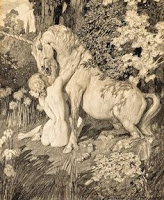

# О любви / On Love
> &mdash; Я имею в виду, как тогда можно отличить ту песню, которая была раньше, от той, которую господин барон сочинил, если там и слова такие же, и музыка?<br>
&mdash; А у той песни, которую господин барон сочинили, смысл совсем другой.<br>
_В. Пелевин, «Чапаев и Пустота»_

Наивно думать, что можно слету добавить что-то существенное к теме данной главы. Можно отделаться шуткой или афоризмом. Например, все знают, что «Бог есть любовь». А поскольку все знают, что такое Бог, то вопрос о любви можно считать закрытым. Или так: слово «любовь» происходит от «любой». В реальности, конечно, любовь – как и все слова – представляет собой нечто вроде пустой консервной банки, каждый складывает туда что под руку попалось, время от времени что-то добавляет или убавляет, и главное, не показывает другим что там у него. В результате в качестве любви практикуется некая зависимость – один человек выделяет или производит нечто, что очень нужно другому. Иногда это происходит в обе стороны, иногда это нечто материальное, иногда нет. Все это дополнительно осложняется тем, что словами люди подают одни сигналы, действиями другие, думают третье, а чувствуют четвертое.

Во времена моего детства была такая сказка про Машу и Витю, бывшая в виде грампластинки и фильма. «Маша верит в сказки, Витя не верит» - я бы сказал, все с точностью до наоборот, или хотя бы так: Маша верит в одни сказки, Витя в другие. Ну да не суть. Попадают они, значит, в гости к фее, фея поет: «Мне нравятся птички и рыбки, веселая трель ручейка, и я не могу без улыбки смотреть на полет мотылька». Ночью оказывается, что фея – Баба Яга, и тоже поет: «...сырыми их ем по привычке, солю, мариную, копчу... жаркое из Машки и Витьки сегодня подам я к столу». Применительно к Бабе Яге можно говорить о том, что одна «сторона» «настоящая», другая – нет. В повседневности такую границу провести сложно или вообще нельзя. Я встретил песню, которая очень точно отражает подобный дуализм. Точнее, встретил я ее давно, но однажды понял, что ее смысл можно понять и совершенно другим образом. В порядке своего вклада в тему данной главы я приведу здесь саму песню, подстрочник ее «обычного» значения и «второго». Встречайте – (крипто)гимн (крипто)любви: ‘Power of Love’, написанный и первоначально исполненный Дженнифер Раш в 1984 году, но сегодня больше известный в исполнении [Селин Дион](http://www.youtube.com/results?search_query=celine+dion+power+of+love).

Начать можно уже с названия. Дело в том, что слово power очень многозначное. Например, известное высказывание «знание - сила» на английском звучит именно как ‘knowledge is power’, и означает не «силу», а «власть». ‘Powers that be’ – «власть предержащие». Итак, второе название – «Власть любви». Слово «любовь» надо понимать в кавычках, т.к. мы говорим о любви совсем в другом смысле, чем в «обычной» версии. Обычная версия – версия «феи», она поет о чем-то таком сказочно-возвышенном и жертвенном, не от мира сего, небесном йогурте. Вторая версия – версия вполне земного циничного манипулятора, хоть и страдающего.  Но исполняются обе эти версии одновременно.

````
The whispers in the morning         Утренний шепот
Of lovers sleeping tight            Спящих в обнимку влюбленных
Are rolling by like thunder now     Раскатывается громом
As I look in your eyes              Когда я смотрю тебе в глаза
````

Tight в данном контексте значит также и «тепло, безопасно», обычное английское пожелание на ночь. Но чу, надвигается буря – дама пристально смотрит в глаза, говорит вкрадчиво и читает невербалику. Это такой допрос-внушение, который практикуют многие и именно в постели, когда мужчина расслаблен, в полусне и плохо себя контролирует. А lovers значит любовники, в хорошем телесном смысле, т.е. к активным супругам это тоже может относиться.

````
I hold on to your body             Держусь за твое тело
And feel each move you make        И чувствую каждое движение
Your voice is warm and tender      Твой голос теплый и нежный
A love that I could not forsake    Любовь, от которой я не отрекусь
````

Hold, hold on – значит также и «держать» в переносном смысле, как, например, «держат ларек» или «держат в ежовых рукавицах». Мужчину «держат за тело» как собственность, во всех смыслах, и иногда прямо говорят об этом, а иногда при таком допросе и щупают пульс – чтение невербалики продолжается: «щупают» все тело своим телом, каждое мелкое движение (речь здесь совсем не про секс), внимательно слушают голос – тон, стресс, настроение, отношение. Результатом утренней диагностики, похоже, довольны, так что на данный момент бросать не будут, будут держаться дальше.

припев:

````
'Cause I am your lady              Потому что я твоя женщина
And you are my man                 И ты мой мужчина
Whenever you reach for me          Когда бы не обратился ко мне
I'll do all that I can             Сделаю все, что в моих силах
````

Lady – это не просто женщина, это обращение слуги к благородной госпоже, например, начальника охраны к королеве. Аналогично, «вся королевская рать» - по-английски ‘all the King’s men’. Man – это служащий. Мы слышим разговор королевы со слугой, и как многие начальники, она говорит, мол, «сделаю все что смогу». Но, как понимаете, «все, что смогу» от начальника имеет несколько другой смысл – никто ничем жертвовать не будет, разве что при хорошем настроении окажет некий фавор. Вспоминается визит Атоса к королеве, с тем, чтобы напомнить о том, что для нее было сделано, и что тому, кто это сделал нужна помощь. И ее реакция, конечно.

````
Lost is how I'm feeling             Чувствую себя потерянной
Lying in your arms                  Лежа в твоих руках
When the world outside              Когда внешний мир
Is too much to take                 Невозможно выносить
That all ends when I'm with you     Это прекращается, когда я с тобой
````

Lost – также и «запутавшаяся», а lying – можно прочитать как деепричастное от «лгать, врать». Она знает, что манипулирует им, «врет жизнью» так сказать. Время от времени на фоне стрессов накатывает осознание этого неприятного факта, но оно отгоняется – она прячется в настоящих чувствах того, кто их испытывает на самом деле. Она смотрит на свое отражение в его душе, а он понятия не имеет с кем находится рядом, и просто проецирует на нее свою аниму. Так леди и живет. Выживает.

````
Even though there may be times       Хоть, возможно, будут времена
It seems I'm far away                Когда покажется, что я далеко
Never wonder where I am              Не надо меня искать
'Cause I am always by your side      Потому что я всегда рядом с тобой
````

Тут даже два дополнительных смысла. Во-первых, леди может иногда слишком уходить в свои дела, но мужчину инструктирует, что все в порядке, не волноваться, леди взяла паузу, дайте ей время и личное пространство. Во-вторых, леди тонко намекает, чтобы мужчина не расслаблялся и не чувствовал себя слишком свободно и независимо, «высоко сижу, далеко гляжу».

````
We're heading for something     Мы движемся куда-то
Somewhere I've never been       Где я никогда не была
Sometimes I am frightened       Иногда мне страшно
But I'm ready to learn          Но я готова учиться/познать
Of the power of love            Силу любви
````

Леди осваивают эту науку управления как минимум с пубертата, но обычно и раньше. Мальчики сшибают друг другу рога из-за девочек еще задолго до того, как понимают зачем они это делают. Эта способность щелчком пальцев сделать так, что один человек прольет кровь другого, с одной стороны радует возможностями, с другой пугает своими масштабами, тем более, что иногда прилетает бумерангом и леди. Но поскольку никакого другого способа дальнейшей жизни она не видит и не знает, а практика уже есть, то она полна решимости осваивать эту алхимию власти и дальше, прокачивать и оттачивать, чтобы проливалась уже не кровь, а что-нибудь более няшное и полезное в хозяйстве, и желательно подольше.

````
The sound of your heart beating    Звук твоего бьющегося сердца
Made it clear suddenly             Вдруг прояснил
The feeling that I can't go on     Что чувство, что я не могу идти дальше
Is light years away                Улетело на несколько световых лет
````

Окончание про невербалику и подпитку от другого – звук сердца успокоил, энергетика восстановилась, момент слабости и страх потери контроля пройден. Сеанс допроса-внушения закончен, на некоторое время можно расслабиться. Не забывайте про припев в нужных местах – там объясняется как и почему все это живет и работает.

Итак, "любовь" - это власть, контроль и управление (в английском это вообще одно слово - control). Классический вопрос "ты меня любишь?" - проверка систем управления. А "скажи, что ты меня любишь" - это приглашение подписать карт-бланш.

Проиллюструю эту своеобразную любовь на феномене взаимной любви женщин и лошадок.



Современный культ лошади восходит к мифу о Единороге`*` (единорог - обязательная западная игрушка девочек, по количеству, возможно, превышающая Барби). Лучший из доступных единорогов - лошадь. А "лучшая лошадь - это мерин" (цитата одного тренера). Девочки любят лошадок до поросячьего визга, и составляют 95% учеников в любом КСК. Лошадь, со своей стороны, тоже сильно привязана к хозяевам и постоянным наездникам. Но за этой мимимишной картинкой не видно главного - за исключением очень ограниченного числа особенных школ, все управление лошадью работает за счет причинения боли или угрозы причинения: узда, хлыст, шпоры. Даже если используется только узда - весь механизм работает на чрезвычайной чувствительности уголков лошадиного рта. Спортивная же езда вообще по сути истязание. Вот "така любоф".

P.S. Было бы ошибкой утверждать, что рассмотренная песня единственная в своем роде. Двойной-тройной  смысл присутствует очень часто. Следующий пример я оставляю для самостоятельного рассмотрения:

````
I am a woman in love          Я влюбленная женщина
And I do anything             И я сделаю что угодно,
To get you into my world      Чтобы заполучить тебя в свой мир
And hold you within           И удержать внутри.
It's a right I defend         Это право, которое я защищаю
Over and over again           Снова и снова и снова

What do I do?                 Что мне делать?
````

`*` Найдите и прочитайте миф о Единороге. Единорог - символ маскулинности, мужской энергии.
