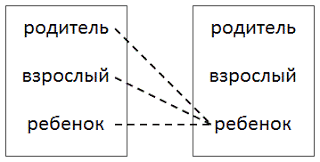

# Нечистый / Impure

> Как хорошо, когда есть сын –<br>
Он самый лучший из мужчин.<br>
Мой солнца лучик золотой,<br>
Улыбка, что всегда со мной!<br>
Прекрасней в мире счастья нет!<br>
Души моей он яркий свет!<br>
Как хорошо, когда есть сын!<br>
Он самый важный из мужчин.<br>
_Популярное из ленты на Ok.ru_

> Ребенок – гость в твоем доме. Накорми, обучи и отпусти.<br>
_Индейская поговорка_

«Нечистый» - примерно так переводится с латыни слово incestum, и означает «сексуальные отношения между близкими родственниками». Большинство культур мира считают подобные отношения ненормальными, недопустимыми, и не разрешают заключать браки в таком случае, хотя само понятие «близкие родственники» не универсально, отличается от страны к стране. В РФ запрещается брак между: детьми и родителями (в т.ч. приемными), прародителями и внуками, полнородными и неполнородными братьями и сестрами. Подобные табу существуют очень давно (бывали и исключения, например, в городе Арсиное ок. 1800 лет назад). Люди знали, что подобные союзы часто приводят к плохим результатам, хоть и не могли объяснить причину.

А причина – в «спящих» генах. Генах, которые могут нести тяжелые последствия для плода, если будут активированы. Если мужчина является носителем такого опасного гена, который есть, скажем, у 1% населения, то если он избежит близкородственных связей`*`, шансы у плода на проявление этого гена составят 1:400 (множитель «4» появляется из-за того, что каждый ген в половой клетке проявляется с вероятностью 50%). Если такой мужчина`**` зачнет ребенка со своей дочерью, то соответствующий шанс будет уже 1:8, т.е. риск возрастает в 50 раз. А учитывая, что таких генов человек может носить множество, перспектива безрадостная.

Таковы последствия, если место нормального полового партнера занимает собственный ребенок.

А что происходит, если физического контакта нет, но собственный ребенок психологически занимает – точнее, ставится на – позицию партнера? Возникает явление «эмоционального» или «психологического» инцеста.

Эрик Берн в своей теории транзакционного анализа так описывает состояния сознания и их коммуникацию между людьми (в один момент времени работает один уровень):



Общение (нормальное) равных – друзей, партнеров – это общение на уровне «взрослый-взрослый».

Во всех случаях речь идет про «внутреннего родителя», «внутреннего ребенка», «внутреннего взрослого». Но это нормально, что родитель общается с ребенком в основном по линии «родитель-ребенок». Ненормально – когда общение с ребенком ведется по линии взрослый-взрослый, причем ребенок может играть и роль друга, и роль партнера, а иногда – даже родителя. Для обозначения таких искаженных ролей в литературе используется слово «суррогатный» - но в данной главе это не имеет никакого отношения к репродуктивным технологиям, только к психологическим ролям – «суррогатный бойфренд», «суррогатная мать» и т.д.

Важно понимать, что в отношениях взрослых каждый сам отвечает за свои психологические границы. Если вы заметили, что вашу роль «смещают» - ваша задача это понять и скорректировать. Но на ребенке такой ответственности лежать не может. Он как жидкость – принимает форму того сосуда, в который ее нальют. Модели того, что есть нормально для ребенка, взрослого и родителя, ребенок и приобретает в процессе воспитания. __Ответственность за эти модели лежит только на родителе.__ Перечитайте эту фразу трижды, медленно.

Итак, если родитель назначает ребенку роль несвойственного ему положения в отношениях – супруга, партнера – это и называется «эмоциональным инцестом». В этом случае речь идет о суррогатном супруге. В более общем случае психоаналитики определяют все это явление как «связь с нарушением границ». Родитель использует ребенка как свою психологическую поддержку, как средство удовлетворения своих эмоциональных нужд, вместо того, чтобы поддерживать ребенка в его эмоциональном развитии.

Также важно понимать, что это не просто безобидная личная особенность конкретного родителя. __Эмоциональный инцест – это разновидность психологического абьюза__`***`. Перечитайте эту фразу трижды, медленно. Пережившие подобное правильно называются «жертвами», а для преодоления последствий применяются те или иные методы терапии, т.е. требуется лечение.

Последствия эмоционального инцеста разрушительны, многоплановы, имеют эффект домино и распространяются через поколения, копируя модель по матрице.

Паттерн папа-дочь, «папина принцесса», можно проиллюстрировать следующими цитатами:

>У меня удивительный отец, но мать его не ценит… Она в депрессии, и лучше вообще бы ушла… Отец ненавидит моего мужа и говорит, что достойных меня мужчин нет… Я так его люблю.

>Отец всегда говорил мне, что я должна получать только лучшее, а все остальное признак неуважения… Он говорил мне, чтобы я требовала лучшего от бойфрендов, всегда больше, чем они хотели бы дать.

>У моей жены взрослая дочь от прошлого брака. Она незрелая, вышла за мужчину старше, похожего на ее отца… Она одержима своим сыном, и угрожает разводом, если муж вмешивается в ее одержимое родительство.

>Моя бывшая жена молилась на своего отца и ненавидела мать за то, что та его эксплуатировала. После 6 лет критики и оскорблений я ушел от ее постоянного давления «стать мужчиной», что значило больше походить на ее отца.

>Я пытался показать бывшей жене как сильно я ее любил, но она всегда сравнивала меня со своим отцом. Я не мог его перегнать, и когда прекратил гонку, мы разошлись.

>Гораздо более распространен паттерн мать-сын, «мамин принц»:

>Я жила с маминым сынком 7 лет. Недавно ушла, но все еще страдаю и чувствую предательство. Ощущение, что у меня был длинный роман с женатым мужчиной. Просила его обратиться к специалисту, но он говорил, что сам справляется со своими проблемами, когда они есть.

>С тех пор, как сын-подросток переехал к отцу, мне ужасно одиноко, депрессия, чувствую предательство. Сын приезжает раз в несколько недель, и хотя знает, что мне грустно без него, не возвращается. \[Психолог\] сказал, что сын нужен мне больше, чем я ему.

>Мой последний бойфренд был 42хлетним ребенком, который не хотел разочаровать маму. Он ничего не делал по дому и все время ей звонил. Звонил, когда уходил, когда приходил, и днем тоже. Расстраивался, когда я говорила с ним, как со взрослым.

>Родители развелись, и я остался с мамой. В 13 мама легла ко мне в постель. Гладила… я знал, что это нехорошо, но не мог пошевельнуться. Это продолжалось, пока я не пригрозил рассказать отцу. В 32 я не мог выносить женского прикосновения. Но после успешной терапии женился.

>Моему сыну 35. Его отец ушел 30 лет назад. Хотя он был блестящим студентом, у него нет амбиций. Его ничего не интересует, кроме моей готовки. Я купила ему квартиру, но не могу заставить переехать. Говорит, что мне в доме нужен мужчина. Но если меня навещает друг, он расстраивается по нескольку дней.

>Это была любовь с первого взгляда. Я знала, что он создан для меня, с момента встречи. Годы спустя я поняла, что вышла за своего отца.

>Муж хорошо ко мне относится тогда и только тогда, когда его мать это одобряет. Как только ей что-то не нравится, наш брак страдает. У нее в руках пульт от нашего брака.

Вариантов дисфункциональных паттернов довольно много. Объединяет их всех одно – отсутствие понятия о здоровых границах между взрослыми, детьми и родителями. Очень важно – и это проиллюстрировано в примере про «любовь с первого взгляда» - что как правило пары создают ДВА человека с похожей проблемой. Здоровый человек не будет ждать 7 лет, чтобы понять, что с партнером что-то не так. Он увидит это на 3ей, максимум на 10й встрече, и уж точно после знакомства с родителями.

Начинается новый цикл всегда одинаково – с рождения ребенка. И либо сразу после рождения, либо некоторое время спустя, один из родителей замещает ребенком партнера либо делает из него «лучшего друга». Такой родитель сам вышел из дисфункциональной семьи и неспособен поддерживать отношения взрослый-взрослый. Еще до рождения ребенка такая пара поддерживает отношения по модели родитель-ребенок (причем роли могут периодически меняться). После рождения, например, мать может впасть в сильную депрессию из-за того, что фокус внимания семьи сместился с нее. Ответ – стать супер-матерью. Что будет с мужем супер-матери? Ему покажется, что он перестал существовать, особенно в том случае, если вся его эмоциональная поддержка исходила от жены. Дальше такие отношения развиваются по нисходящей спирали. Когда мать остается одна – или если она была одна изначально – процесс может только усугубиться. Ребенку-дошкольнику могут на полном серьезе говорить, что он теперь «главный мужчина в доме», что он «мамина опора и поддержка», «смысл жизни» и «лучший из мужчин».

Вот колыбельная в исполнении Шинед О’Коннор:

<iframe width="560" height="315" src="https://www.youtube.com/embed/9rl_b3DsPW4" frameborder="0" allow="accelerometer; autoplay; encrypted-media; gyroscope; picture-in-picture" allowfullscreen></iframe>

````
My darling child
My darling baby
My darling child
You gave life to me
My darling child
My darling baby
My darling child
You came and saved me

Мое дорогое дитя
Мой дорогой малыш
Мое дорогое дитя
Ты дал мне жизнь
Мое дорогое дитя
Мой дорогой малыш
Мое дорогое дитя
Ты пришел и спас меня
````

и т.д. К слову, альбом с говорящим названием 'Universal Mother', т.е. "Вселенская мать".

Вот чуть более взрослый вариант: серия из «Южного парка» 10.07 «Тсс»:
_need flash player so..._

Имейте ввиду, что это хоть и правдоподобно, но все же юмор. Однако, примечание: Сезар Миллан – реальный человек и большой профессионал своего дела, но все его знания не сильно помогли ему в его собственной жизни, о чем рекомендую прочитать самостоятельно. Обратите внимание, герои прямо проговаривают, что постановка ребенка в правильную для него роль естественно означает потерю друга в его лице. Отсюда и трагический финал, когда мать не только не сдерживает отвоеванные границы, но сама их нарушает.

И семейный адвокат Кери Линде, серьезнее:

<iframe width="560" height="315" src="https://www.youtube.com/embed/643wFekR7A0" frameborder="0" allow="accelerometer; autoplay; encrypted-media; gyroscope; picture-in-picture" allowfullscreen></iframe>

> Я чувствовала себя матерью своей матери. Она незрелая и одинокая, я была рядом с ней с тех пор, как умер отец. Это значило - никакого университета, и почти без бойфрендов.

Другие встречающиеся странные структуры границ:
- мама и дочь - лучшие подружки;
- муж - старший брат детям;
- папа и мама включают ребенка в свой треугольник на равных правах взрослого, обсуждают с ним планы, используют для взаимосвязи между собой, в т.ч. для улаживания конфликтов;
- родитель изображает капризного ребенка, а ребенок становится ему "родной матерью";
- один из детей назначается вторым родителем для остальных детей, и начинает выполнять по отношению к ним родительские функции;
- родители забыли выполнить последний пункт индейской поговорки - забыли отпустить детей, и продолжают родительствовать даже когда у детей уже своя семья и дети; такие родители могут даже вытеснять детей из родительской роли, становясь "главными" родителями и для внуков тоже (причиной для этого может быть, что прародители уже давно не могут оставаться просто вдвоем, выросшие дети выполняли скрепляющую функцию; отсюда же "проблема опустевшего гнезда" - всплеск разводов после ухода детей, у родителей просто нет никакой общей супружеской зоны, только родительская).

Тут стоит упомянуть частый совет разведенным отцам у которых сложные отношения с детьми (см. главу "Чужой") - "ну договаривайтесь как-нибудь, общайтесь с ребенком". Причем такой совет могут давать, казалось бы, вполне себе профессионалы - педагоги, сотрудники ООиП, даже психологи. И таким профессионалам, бывает, стоит пояснить: г-да, родитель с ребенком не общается, родитель ребенка воспитывает, в т.ч. личным примером. Общается ребенок с друзьями, одноклассниками. Фактически подобный совет призывает родителя встать на один уровень с ребенком - т.е. либо обоим быть детьми, либо обоим быть взрослыми. А это, как уже было сказано, психологический абьюз.

Также часто на Ok.ru вполне взрослые, даже замужние женщины цитируют и ставят "лайки" на фразу о том, кто такой "настоящий мужчина":
"Значит, дорогая, слушай меня: Мои проблемы - это не твое дело, а вот, твои проблемы - это мои проблемы, и решать их буду я..."

По одной такой фразе сразу многое видно. Во-первых, кому такая фраза подходит, какой роли? Кому-то вроде предпубертатного подростка. Это подростка нельзя нагружать проблемами родителя, это за подростка нужно решать его проблемы, и то не все. Первое, что приходит на ум - роль папы. Но некоторые психологи считают, что речь идет даже не о папе, а о маме. Что конкретно произошло со взрослой женщиной 30+, у которой уже и свои дети есть, но пуповина все еще не перерезана? Неизвестно. Что известно - что партнерские отношения, если она вообще сможет их поддерживать, ее не устроят, она будет копить обиду и срываться на мелочах. Во-вторых, в какое положение ставит себя мужчина, если произносит такое всерьез? Подобная позиция, помимо того, что очень несбалансированная, она и не очень человеческая. Человек ценен не только своей полезностью, и человека отличает способность чувствовать, и не всегда эти чувства приятные. Собственно "общение" происходит от слова "общее". Т.е. такой человек занимает либо позицию божества, либо позицию бесчувственного чурбана. Понятно, что и то и другое будет с периодическими срывами крыши.

В главе использованы материалы сайта systemiccoaching.com, ©Martyn Carruthers.

`*` Роберт Сапольски в лекции о родственниках приводит [такое рассуждение](https://www.youtube.com/embed/P388gUPSq_I?start=3143&end=3310&version=3). С одной стороны, чтобы избежать близкородственного скрещивания, имеет смысл искать как можно более генетически далеких партнеров. С другой - слишком далекий партнер приводит к размыванию своей породы. Все-таки задача выживания - передача своей ДНК, а не чужой. Оказывается, в природе наблюдается точка равновесия, оптимально балансирующая между этими двумя силами: четырехюродные родственники. И эта точка имеет также научно-математическое обоснование.

`**` Для тех, кто думает, что это "чисто мужская" проблема - книжка, полистать для общего образования: Beverly Ogilvie, 'Mother-Daughter Incest: A Guide for Helping Professionals'.

`***` Англ. abuse - в широком смысле означает "использование не по назначению", "варварское использование". В контексте обращения с животными и людьми - злоупотребление, жестокое обращение, оскорбление, надругательство.

Дополнительный материал:
- [Психологический инцест](//psychologos.ru/articles/view/psihologicheskiy_incest)

Дополнительные материалы, англ.:
 - [Surviving The Emotional Cancer Of Enmeshment - Special Guest Jerry Wise, Relationship Expert](//youtube.com/watch?v=l2qLEMw-fjg)
 - [Counseling: Enmeshed with Parents](//youtube.com/watch?v=wuKKhXp8Ktg)

Вопросы для самостоятельной работы.
1. Найдите и прочитайте биографию Сезара Миллана.
2. Найдите и прочитайте о семейной структуре, именуемой "бабья яма".