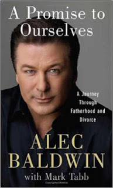

# Чужой / Alien

> Узнаю, кто из вас с отцом видится — прокляну! 
_к/ф «Любовь и голуби»_

Героиня этого отвратительного и глубоко ненавидимого мной советского фильма коротко и четко выразила целое явление, которое было известно уже довольно давно, но имя получило недавно. Да, манипулятивные способности женщин, помноженные на их эгоизм и психологическое слияние с детьми, могут и будут использоваться ими для разделения и отчуждения отцов и детей.

Способов достигнуть этого существует масса, и неважно, что среди приемов есть сознательные и бессознательные – результат один. Кроме собственно манипуляций, велика вероятность применения женщиной и «грубой силы» - чинения препятствий для очного и телефонного общения, смена и сокрытие места жительства и т.п.

<iframe width="560" height="315" src="https://www.youtube.com/embed/PXS5UOILmwg" frameborder="0" allow="accelerometer; autoplay; encrypted-media; gyroscope; picture-in-picture" allowfullscreen></iframe>

Систематизировал и описал это весьма распространенное явление американский психиатр Ричард Гарднер (Richard Alan Gardner, 1931–2003), еще в 80х годах прошлого века. Назвал он его 'PAS', т.е. ‘parental alienation syndrome’ или «синдром отчуждения родителя». Не следует путать его с ‘PA’, ‘parental alienation’. PAS – это набор характерных признаков, которые наблюдаются у ребенка, на которого воздействует родитель, PA – это процесс, набор действий, которые осуществляет родитель. Гарднер много публиковался, выступал и участвовал в судебных процессах, связанных с детьми, на Ютубе есть его [видеолекции](http://www.youtube.com/results?search_query=richard+gardner). Он добивался включения этого синдрома в международный классификатор болезней, но так этого и не добился. Мнения в научном сообществе относительно этого вопроса разделились. Также понятно, что большим политическим силам признание PAS скорее невыгодно, т.к. если признать его болезнью, то можно привлекать к ответственности виновных в ее появлении у детей, а эти виновные сами понимаете какого пола, а этот сами понимаете какой пол представляет собой численное большинство, существенно влияет в демократических выборах и вообще очень ценен для разных больших дел, а потому всегда прав.

В принципе все проявления этого синдрома вы можете узнать у любого разведенного отца, которого ранее любящий ребенок начинает отвергать. Достаточно подробно и в красках свой опыт личного переживания PA изложил известный голливудский актер Алек Болдуин в своей книге «Обещание себе: путешествие через отцовство и развод» (Alec Baldwin, '[A Promise to Ourselves: A Journey Through Fatherhood and Divorce](http://www.amazon.com/Promise-Ourselves-Journey-Through-Fatherhood/dp/B002BWQ55E/ref=sr_1_1?s=books&ie=UTF8&qid=1400055142&sr=1-1&keywords=promise+to+ourselves)', которая, к сожалению, на русский язык не переводилась.

Алек Болдуин был женат на не менее известной актрисе Ким Безинджер, которая подала на развод, когда их дочери Айрленд было 5 лет. В течение 7 лет Алек бился в судах за то, чтобы участвовать в жизни дочери, спорящие стороны потратили в сумме более 2 млн. долларов на это. Ким применяла все известные средства, чтобы разделить отца и дочь, и, по большому счету, преуспела в этом, а сам Алек дошел до нервных срывов и почти дошел до самоубийства.

Читать книгу Алека больно: все там очень знакомо, только масштаб существенно больше. То, что с ним творили – буквально бесчеловечно, а то, что он все еще жив, причем в стране со свободной продажей оружия – своего рода чудо и заслуга его родни. В книге излагаются тонкости разводных процессов в Калифорнии, о которых он тоже мало знал до столкновения, принципы работы судебных экспертов, психологов и медиаторов, а также его приключения и стадии личной трансформации, через которые пришлось пройти под давлением обстоятельств. Одним из главных моментов книги является его рассказ широким массам о том, кто такой Ричард Гарднер и что такое PAS.

Прежде чем перечислить признаки PAS и классификацию степеней выраженности, стоит сразу оговориться, что уж если Алеку Болдуину с его возможностями мало чего удалось достигнуть в противодействии, то обычному человеку и подавно. В РФ, как и в Америке, даже если вы поймаете другого родителя за нарушение порядка общения ему за это, в общем, ничего не будет, и за психологическое насилие над ребенком тоже. А уж ваши собственные интересы и проблемы вообще никому не сдались. Лучшее, что вы можете противопоставить – знания по психологии, полученные самостоятельно или от специалистов, а официальные лица будут советовать либо «договариваться по-хорошему» либо «оставлять в покое». В определенных экстремальных случаях даже профессиональные психологи могут рекомендовать полное прекращение общения с ребенком, «психологический развод».

Гарднер так определяет PAS: психологическое расстройство, при котором ребенок одержим осуждением и критикой родителя, несправедливо или преувеличено. Как правило, PA производит родитель, с которым ребенок проживает, а целью становится второй родитель.

Случаи PAS по выраженности симптомов условно делят на легкие, средние и тяжелые. В легком варианте ребенок не протестует против визитов второго родителя, однако критичен и раздражен. В среднем варианте ребенок не подчиняется и проявляет открытое неуважение; может допускать визиты, но не рад им. В тяжелых случаях визиты становятся практически невозможными, ребенок может физически нападать на родителя; как минимум, в тяжелых случаях ребенок стремится причинять эмоциональные страдания, может демонстрировать параноидальный страх при визитах.

Ниже для удобства родитель, настраивающий ребенка против другого обозначается «АР» (атакующий), а родитель-мишень – «МР».

Признаки синдрома, описанные Гарднером:

1. Кампания очернения 
Ребенок не просто расстроен или фрустрирован ситуацией развода, но полностью отторгает, активно ненавидит МР, копируя фразы АР. АР часто занимает позицию жертвы в разводе и группируется с ребенком: «твой отец бросил нас». Сюда же относится сбрасывание телефонных звонков с объяснениями ребенку, что никто не звонил, рассказы ребенку, что МР плохо о нем отзывался и т.п.

2. Слабые или абсурдные объяснения очернения 
Примеры: "он храпит", "она жирная", "заставляет ложиться спать рано", «дает мороженое только после домашнего задания» и т.п.

3. Отсутствие равновесия в оценках родителей 
АР - воплощение всего добра и только добра, МР - зла и только зла, вплоть до аналогий с Гитлером. Причинение страданий такому человеку не только не плохо, но и похвально. Часто эти эффекты проявляются только в присутствии АР, а наедине с МР ребенок может вести себя нормально.

4. Феномен "независимо мыслящего" 
Ребенок сам заявляет, что не хочет видеться с МР, хотя АР даже упрашивает (на публике). Как замечено, никакой суд не позволит ребенку, например, не ходить в школу, потому что ему не хочется, однако в случае визитов МР это прокатывает. Исследования показывают, что для объяснения своего нежелания визитов дети могут лгать и лгут.

5. Автоматическая поддержка АР 
Ребенок чувствует, что должен "выбрать сторону" в конфликте, и выбирает; после - во всем поддерживает выбранную сторону.

6. Отсутствие чувства вины за жестокость или использование МР 
Пример: "он недостоин меня видеть, он ничтожество, и алименты - отличное наказание для него", «хорошо, что он расстроен – это за то, что он с нами сделал» и т.п. Попытки МР пойти на контакт могут отвергаться, подарки – возвращаться или уничтожаться.

7. Использование чужих сценариев 
Ребенок рассказывает негативные истории про МР, которые звучат как заученные, использует слова не из своего обычного словаря. Часто про такие истории доподлинно известно, что их физически не могло происходить.

8. Отвержение семьи и друзей МР 
Распространение такого же отвержения, пусть и слабее выраженного, на бабушку, дедушку и прочих близких МР.

Главное оружие в руках АР – время. Чем больше времени ребенок проводит с АР, тем сложнее выправить ситуацию, а часто она уже неисправима. Гарднер в своих лекциях рассказывает про меры противодействия PAS, но в основном приводит тяжелые случаи, в которых иногда удается получить содействие суда (речь про США, конечно). В РФ в обозримом будущем рассчитывать особо не на что – вы сами согласились на то, чтобы у вас взяли заложника. Возможно, до заложника что-то дойдет лет через 20-30, а возможно и нет.

Некоторые психологи перечисляют меры, которые точно НЕ работают:
- Выжидание
- Переговоры
- Психологи-медиаторы (если нет двустороннего желания)
- Попытки переубедить АР, объяснить что-то
- Попытки ублажать АР

Что остается?

- Поддерживать четкие эмоциональные и физические границы
- Фокусироваться на своем поведении, не на поведении АР
- Прекратить бояться АР
- Вести себя проактивно, а не реактивно поведению АР
- Продолжать родительскую роль, воспитывать ребенка, а не ублажать
- Поддерживать отношение «нейтральной зоны», где ребенок может свободно выражать все

В своей книге Болдуин вспоминает момент, когда он впервые увидел в жене отблеск будущего PAS – это случилось в день, когда она сообщила ему, что беременна. Он, конечно, не понял этого тогда, но зато отлично понял задним числом. Да, если в нужный момент присмотреться, PAS виден задолго до рождения. Думаю, даже и до беременности. В принципе, PAS можно разглядеть уже на знакомстве с родителями, если смотреть внимательно. И не забывайте про мотивацию, которая обсуждалась в главе о беременности – все слагаемые PAS там тоже присутствовали. Красные флажки, которых следует особенно опасаться – фразы и идеи вроде «мужчине ребенок нужен, пока нужна женщина», «если мужчина любит женщину, то любит и ее детей», «чей бы бычок не вился, а теленок наш» и т.п. родственные им.

Углубляться в корни происхождения PAS здесь, пожалуй, не стоит – читайте про это в тематических книгах и статьях специалистов. В порядке частного мнения могу предположить, что психологические корни этого явления лежат в незрелости личности матери и ее психологических травмах и отклонениях. Эволюционистски же можно предположить, что причины чисто биологические – самка стремится максимально избавиться от присутствия неудовлетворяющего самца, с тем, чтобы быстрее и легче найти нового – см. Закон Бриффолта; если самец периодически приходит к ребенку, то он сужает свободу поведения самки и продолжает быть «вожаком» для ребенка. Т.е. возможно, это просто работа системы выживания, «эгоистичного гена».

* Статистика процент женщин, препятствовавший общению с отцами, сравнение с мужчинами.

На сайте otcovstvo.info есть анонс одной из немногих русскоязычных книг по законодательному ликбезу отцов - Ильина О.Ю., «Права отцов. Де-юре и де-факто». Там же к анонсу висит одинокий отзыв некой Александры (написание сохранено):

> Ильина — ты сука… Ребенко только — МОЙ. Я его скорее в детдом сдам, чем позволю бывшему с ним общатся… Оцовское дело — малое, опылил — и катись колбаской. И не забывай про алименты…

Надо отдать должное – хоть это и не самое грубое, что мне встречалось на эту тему, но неплохо суммирует главу.

Вопросы на подумать:

- К какой категории выраженности PAS относится ситуация: АР говорит ребенку, "давай поиграем; пойдем в полицию и скажешь им, что папа трогал тебя за писю; просто поиграем, будет интересно"? (реальный случай из практики Гарднера)
- Что примерно ожидает такого АР в суде а) США, б) РФ?
- Что примерно ожидает такого МР в суде а) США, б) РФ?